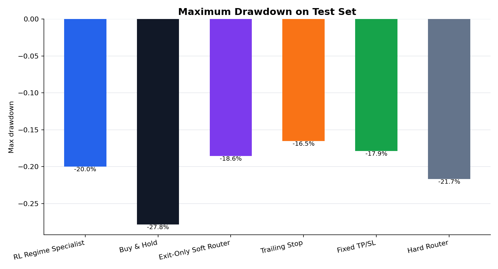
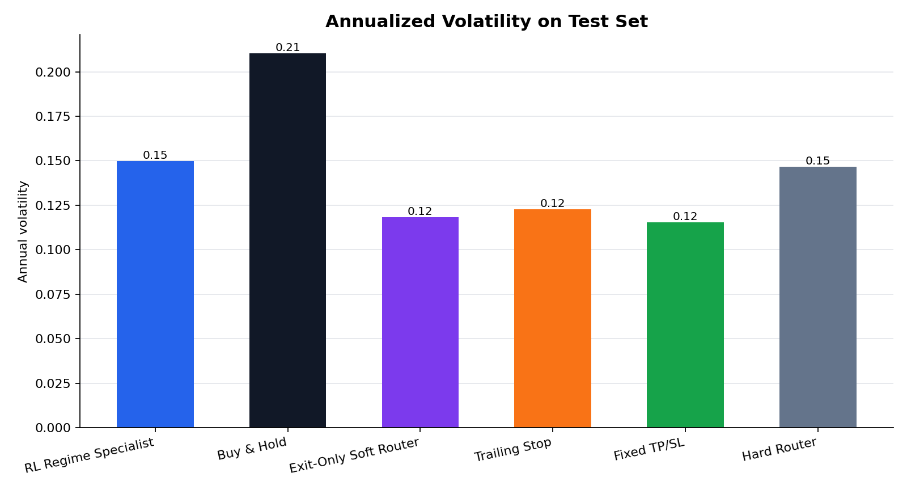
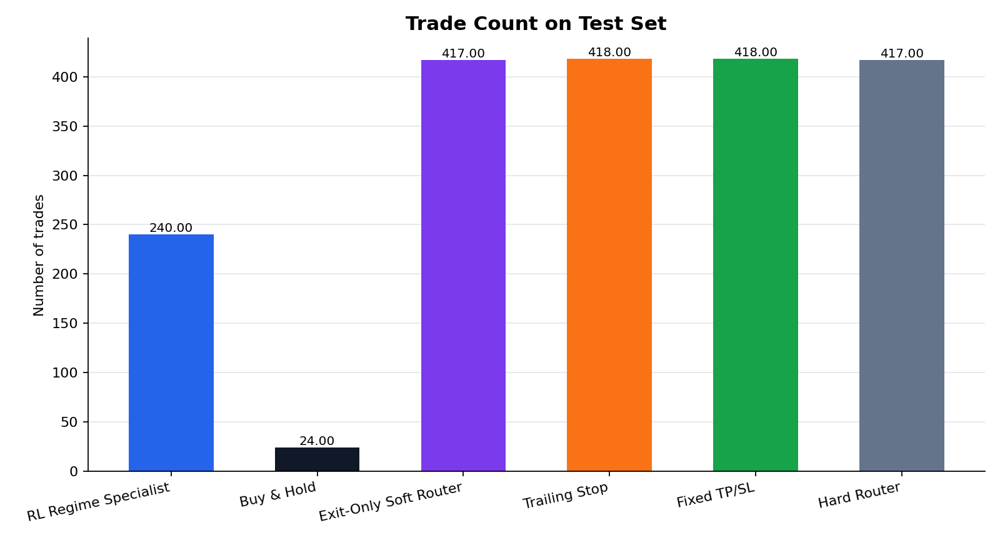
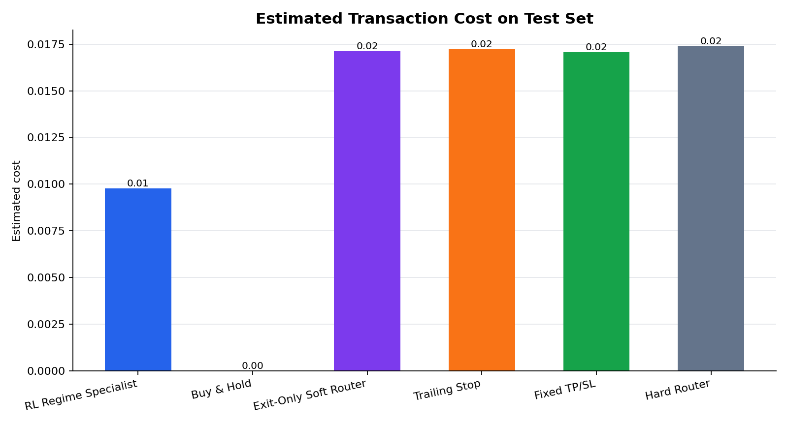

# RL Regime Specialist

Research prototype for regime-aware trading systems.

This repository explores whether market-regime recognition, simulation-pretrained specialist agents, and rule-based risk overlays can improve risk-adjusted performance versus simple buy-and-hold baselines.

Important: this is a research project, not financial advice and not a production trading system.

## Current Project Status

The current project focus is the sell / exit model.

Earlier versions experimented with a full buy-and-sell pipeline, including a regime classifier and entry/risk rules. That buy-side system is not considered solved yet. The current defensible scope is narrower:

```text
Given an existing long position, decide whether to hold or sell.
```

The project should therefore be read as an exit-model research prototype, not a complete trading system. The current research question is:

```text
Can simulation-pretrained regime specialists produce better exit behavior than simple rule-based exits such as trailing stop or fixed take-profit / stop-loss?
```

Current positioning:

```text
Main model: sell / exit model
Buy model: experimental and not yet reliable
Full buy/sell system: not the current claim
```

## Core Components

### 1. Simulated Regime Specialists

Three DQN specialists are pretrained on synthetic price paths:

- bull specialist
- bear specialist
- sideways specialist

Each specialist learns a sell-timing policy in a simulated regime. The environment is a single-position sell-timing setup with actions:

```text
0 = hold
1 = sell
```

Relevant files:

```text
src/simulators.py
src/env.py
src/dqn.py
src/train_specialists.py
```

### 2. Soft Router Exit Engine

A soft router combines the Q-values from the three specialists:

```text
weighted_q = w_bull * q_bull + w_bear * q_bear + w_sideways * q_sideways
```

The final exit decision comes from the weighted Q-values. This is the original model core.

Relevant files:

```text
src/router.py
src/train_router.py
```

### 3. Exit Benchmarks

The current evaluation compares the learned exit model against exit-only and rule-based baselines:

- exit-only soft router
- hard router
- trailing stop
- fixed take-profit / stop-loss
- buy-and-hold reference

Important distinction:

```text
Exit-only soft router, hard router, trailing stop, and fixed TP/SL do not choose entry timing.
They are mechanically entered and then decide when to exit.
```

This keeps the comparison focused on exit behavior instead of mixing it with an unsolved buy-side problem.

### 4. Experimental Buy-Side Components

The repository still contains experimental buy-side modules:

```text
src/regime_classifier.py
src/regime_system.py
src/regime_pipeline.py
```

These modules explored market-state classification and entry/risk filters, but they are not treated as the current validated model. The buy-side system needs more work before it can be presented as a reliable complete trading system.

Current status:

```text
Sell model: current main research object
Buy model: experimental / unresolved
Complete buy-sell system: not yet established
```

### 5. Daily Backtesting

The repository includes both the original episode-level backtester and a newer daily-equity backtester.

The daily backtester supports:

- daily equity curve
- transaction costs
- cash return while out of market
- time in market
- turnover
- drawdown
- risk-adjusted metrics

Relevant files:

```text
src/backtest.py
src/daily_backtest.py
src/metrics.py
```

## Data

The project can download historical daily market data from Yahoo Finance's chart endpoint through `src/data_download.py`.

Downloaded data is intentionally not committed to Git. The `.gitignore` excludes:

```text
data/
models/
outputs/
```

This keeps the repository lightweight and avoids committing generated market data, trained weights, and experiment outputs.

## Installation

```bash
pip install -r requirements.txt
```

Dependencies:

```text
numpy
pandas
torch
matplotlib
```

## Basic Usage

Train simulation specialists:

```bash
python -m src.main train-specialists
```

Train the soft router on a CSV:

```bash
python -m src.main train-router --data data/real_prices.csv
```

Evaluate original baselines on a CSV:

```bash
python -m src.main evaluate --data data/real_prices.csv
```

Run the original pipeline on synthetic data:

```bash
python -m src.main run-all --use-simulated-real
```

## Experimental Full Regime System

The repository still includes the earlier full regime-system command:

```bash
python -m src.main --output-dir outputs/regime_trading_system regime-system \
  --start 2005-01-01 \
  --cost-bps 5 \
  --annual-cash-rate 0.0368
```

This command trains both exit and entry/risk components, but this path should be treated as experimental. The current project narrative does not claim that the buy-side model is solved.

For the current research write-up, the more defensible comparison is the exit-only benchmark visualization.

## Scientific Comparison Backtest

Run the multi-asset optimization and comparison pipeline:

```bash
python -m src.main --output-dir outputs/scientific_comparison optimize-backtest \
  --preset balanced \
  --start 2005-01-01 \
  --cost-bps 5
```

You can also test custom ETF or stock lists:

```bash
python -m src.main --output-dir outputs/custom_test optimize-backtest \
  --tickers "SPY.US,QQQ.US,GLD.US" \
  --preset quick
```

## Metrics

The project reports:

- total return
- CAGR
- annual volatility
- Sharpe ratio
- Sortino ratio
- max drawdown
- Calmar ratio
- number of trades
- turnover
- time in market
- active return vs buy-and-hold
- tracking error
- information ratio

## Visualization

The project can generate research charts for exit-only and benchmark comparisons:

- return
- NAV / net asset value
- Sharpe ratio
- max drawdown
- annualized volatility
- trade count
- estimated transaction cost

Generate charts from a completed regime-system output directory:

```bash
python -m src.regime_visualize outputs/regime_trading_system_no_take_profit
```

This writes:

```text
outputs/regime_trading_system_no_take_profit/figures/nav_test.png
outputs/regime_trading_system_no_take_profit/figures/returns_test.png
outputs/regime_trading_system_no_take_profit/figures/sharpe_test.png
outputs/regime_trading_system_no_take_profit/figures/drawdown_test.png
outputs/regime_trading_system_no_take_profit/figures/volatility_test.png
outputs/regime_trading_system_no_take_profit/figures/trade_count_test.png
outputs/regime_trading_system_no_take_profit/figures/estimated_cost_test.png
outputs/regime_trading_system_no_take_profit/average_nav_test.csv
outputs/regime_trading_system_no_take_profit/visualization_metrics.csv
```

### NAV / Net Asset Value


### Return


### Sharpe Ratio


### Max Drawdown



### Annualized Volatility



### Trade Count



### Estimated Transaction Cost



### Interpretation

Charts are generated after the 200-day feature warmup. The warmup period is excluded from the plotted NAV so the initial cash-only period does not appear as a misleading straight line.

The charts intentionally exclude the full `RL Regime Specialist` buy/sell model. They focus on comparable benchmark mechanisms:

```text
Buy & Hold
Exit-Only Soft Router
Trailing Stop
Fixed TP/SL
Hard Router
```

This keeps the visualization from mixing two different questions:

```text
full buy/sell system quality
vs.
exit-only router / rule benchmark quality
```

The soft router and hard router are both exit-only benchmarks here. They do not choose a real entry point; they are mechanically entered and then decide when to exit.

## What We Learned So Far

The strongest current evidence is about exit behavior, not buy timing.

Observations from the exit-only comparisons:

- The hard router can outperform the learned soft router on return and Sharpe in the current benchmark.
- The soft router is more conservative: lower volatility and lower drawdown, but lower return.
- Simple trailing stop and fixed TP/SL are useful risk controls, but they often sacrifice too much upside.
- A complete buy-side model remains unresolved.

Current interpretation:

```text
The project has a usable sell-model research framework.
It does not yet have a reliable buy model.
```

Limitations:

- Entry timing is still mechanically defined in most benchmarks.
- Router performance may vary by asset universe and market regime.
- The soft router has not consistently beaten the hard router.
- The current model should not be presented as a complete autonomous trading system.

## Recommended Next Direction

The immediate next step is not to keep expanding the buy model. The cleaner path is:

```text
1. Keep the project focused on sell / exit modeling.
2. Compare soft router, hard router, trailing stop, and fixed TP/SL across more assets.
3. Decide whether soft router is worth keeping as the main path.
4. If hard router remains stronger, promote it to the default exit router.
5. Revisit buy-side modeling only after the exit model story is stable.
```

A complete trading system will eventually need a buy model, but that is a separate unresolved problem.

## Repository Layout

```text
src/
  backtest.py              Original episode-level backtesting
  baselines.py             Rule-based baselines
  daily_backtest.py        Daily equity curve backtesting
  data_download.py         Yahoo daily data downloader
  data_loader.py           CSV loading and chronological splits
  dqn.py                   DQN implementation
  env.py                   Sell-timing trading environment
  experiments.py           Multi-asset optimization experiments
  main.py                  CLI entrypoint
  metrics.py               Performance metrics
  plots.py                 Plot utilities
  regime_classifier.py     Independent bull/bear/sideways classifier
  regime_pipeline.py       Full regime-system training and evaluation
  regime_system.py         Entry/risk system + soft exit integration
  router.py                Soft-router ensemble agent
  simulators.py            Synthetic price path generators
  train_router.py          Router training
  train_specialists.py     Specialist DQN training
```

## Disclaimer

This repository is for research and educational purposes only. It is not investment advice, and the backtest results are not evidence of future performance.
