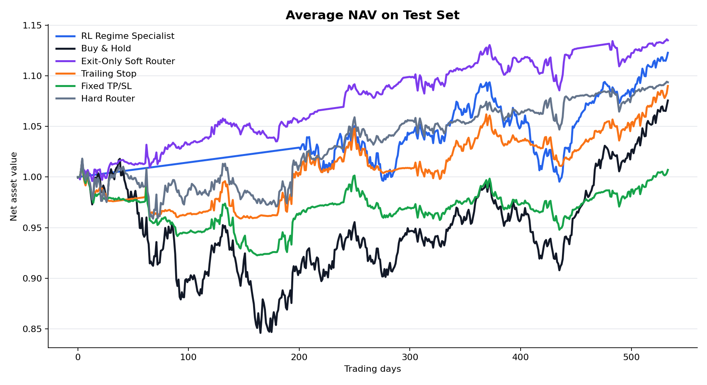
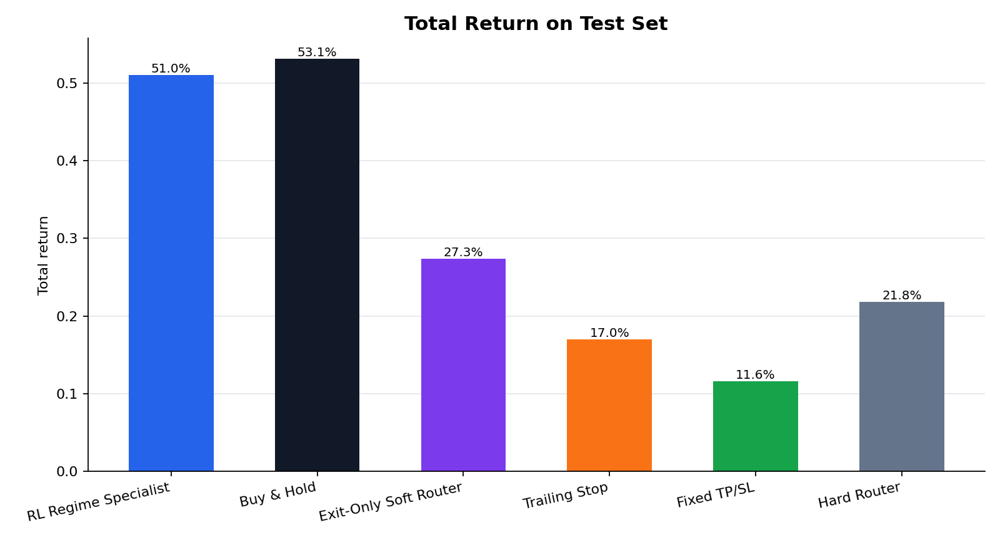
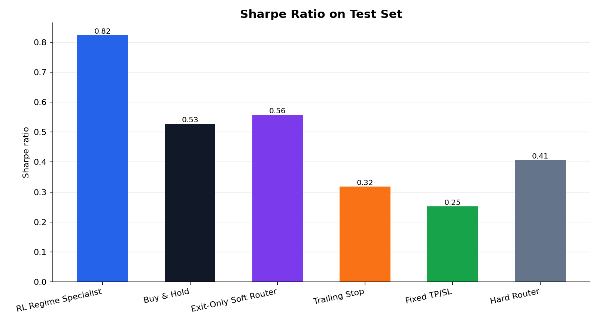

# RL Regime Specialist

Research prototype for regime-aware trading systems.

This repository explores whether market-regime recognition, simulation-pretrained specialist agents, and rule-based risk overlays can improve risk-adjusted performance versus simple buy-and-hold baselines.

Important: this is a research project, not financial advice and not a production trading system.

## Current Project Status

The project began as a simulation-pretrained sell/exit model and evolved into a modular trading research framework:

```text
market data
  -> regime classifier
  -> entry / risk filter
  -> simulation-pretrained DQN specialist exit engine
  -> daily portfolio-style backtest
  -> benchmark comparison
```

The current model is useful mainly as a risk-control overlay. It can often reduce drawdowns and avoid some catastrophic buy-and-hold outcomes, but it has not proven to be a robust standalone alpha engine. In many strong-trend assets such as mega-cap growth stocks, high-beta technology names, and BTC, buy-and-hold can still outperform because the model exits or de-risks too early.

The clearest current positioning is:

```text
Use momentum / relative strength / portfolio rotation as the return engine.
Use this regime model as a risk filter or position-reduction layer.
```

## Core Components

### 1. Simulated Regime Specialists

Three DQN specialists are pretrained on synthetic price paths:

- bull specialist
- bear specialist
- sideways specialist

Each specialist learns a sell-timing policy in a simulated regime. The environment is a single-position sell-timing setup with actions:

```text
0 = hold
1 = sell
```

Relevant files:

```text
src/simulators.py
src/env.py
src/dqn.py
src/train_specialists.py
```

### 2. Soft Router Exit Engine

A soft router combines the Q-values from the three specialists:

```text
weighted_q = w_bull * q_bull + w_bear * q_bear + w_sideways * q_sideways
```

The final exit decision comes from the weighted Q-values. This is the original model core.

Relevant files:

```text
src/router.py
src/train_router.py
```

### 3. Independent Regime Classifier

The newer system adds a separate market-regime classifier. It is not the same as the soft router.

It predicts soft probabilities:

```text
p_bull
p_bear
p_sideways
```

The classifier uses market-only features such as:

- short and medium-term returns
- price relative to moving averages
- volatility
- drawdown
- range position

Training labels are weakly supervised from future 60-day returns:

```text
future_return_60 >= +6% -> bull
future_return_60 <= -6% -> bear
otherwise              -> sideways
```

At backtest time, the classifier only uses current and historical information.

Relevant file:

```text
src/regime_classifier.py
```

### 4. Regime-Aware Entry and Risk System

The current full system uses the independent classifier to decide whether new exposure is allowed:

```text
trend / bull state:
  allow trend entry

sideways state:
  allow pullback/rebound entry

risk-off / bear state:
  avoid new exposure
```

The latest version removed fixed take-profit logic because it cut winners too early. Exits now focus on:

- risk-off probability
- trend drawdown stop
- maximum holding period
- soft-router exit for non-trend states

Relevant file:

```text
src/regime_system.py
```

### 5. Daily Backtesting

The repository includes both the original episode-level backtester and a newer daily-equity backtester.

The daily backtester supports:

- daily equity curve
- transaction costs
- cash return while out of market
- time in market
- turnover
- drawdown
- risk-adjusted metrics

Relevant files:

```text
src/backtest.py
src/daily_backtest.py
src/metrics.py
```

## Data

The project can download historical daily market data from Yahoo Finance's chart endpoint through `src/data_download.py`.

Downloaded data is intentionally not committed to Git. The `.gitignore` excludes:

```text
data/
models/
outputs/
```

This keeps the repository lightweight and avoids committing generated market data, trained weights, and experiment outputs.

## Installation

```bash
pip install -r requirements.txt
```

Dependencies:

```text
numpy
pandas
torch
matplotlib
```

## Basic Usage

Train simulation specialists:

```bash
python -m src.main train-specialists
```

Train the soft router on a CSV:

```bash
python -m src.main train-router --data data/real_prices.csv
```

Evaluate original baselines on a CSV:

```bash
python -m src.main evaluate --data data/real_prices.csv
```

Run the original pipeline on synthetic data:

```bash
python -m src.main run-all --use-simulated-real
```

## Full Regime System

Run the current full system:

```bash
python -m src.main --output-dir outputs/regime_trading_system regime-system \
  --start 2005-01-01 \
  --cost-bps 5 \
  --annual-cash-rate 0.0368
```

This command:

1. Downloads daily data for the default ETF universe.
2. Trains simulated DQN specialists.
3. Trains the soft router exit engine.
4. Trains the independent regime classifier.
5. Tunes entry/risk parameters on validation data.
6. Runs daily test-set backtests.
7. Writes reports under the selected `outputs/` directory.

## Scientific Comparison Backtest

Run the multi-asset optimization and comparison pipeline:

```bash
python -m src.main --output-dir outputs/scientific_comparison optimize-backtest \
  --preset balanced \
  --start 2005-01-01 \
  --cost-bps 5
```

You can also test custom ETF or stock lists:

```bash
python -m src.main --output-dir outputs/custom_test optimize-backtest \
  --tickers "SPY.US,QQQ.US,GLD.US" \
  --preset quick
```

## Metrics

The project reports:

- total return
- CAGR
- annual volatility
- Sharpe ratio
- Sortino ratio
- max drawdown
- Calmar ratio
- number of trades
- turnover
- time in market
- active return vs buy-and-hold
- tracking error
- information ratio

## Visualization

The full buy/sell regime model can now generate research charts for:

- return
- NAV / net asset value
- Sharpe ratio

Generate charts from a completed regime-system output directory:

```bash
python -m src.regime_visualize outputs/regime_trading_system_no_take_profit
```

This writes:

```text
outputs/regime_trading_system_no_take_profit/figures/nav_test.png
outputs/regime_trading_system_no_take_profit/figures/returns_test.png
outputs/regime_trading_system_no_take_profit/figures/sharpe_test.png
outputs/regime_trading_system_no_take_profit/average_nav_test.csv
```

### NAV / Net Asset Value



### Return



### Sharpe Ratio



## What We Learned So Far

The model has shown some consistent strengths:

- Lower maximum drawdown in many tested assets.
- Better outcomes than buy-and-hold on some failed or deeply drawdown-prone assets.
- Useful behavior as a risk filter in some high-volatility paths.
- Modular structure that can be reused as a risk overlay.

But it also has clear limitations:

- It often underperforms buy-and-hold in strong secular winners.
- It exits too early for assets whose returns are concentrated in large trend runs.
- It was originally trained and tuned mostly on ETF-like behavior, so direct transfer to high-beta single stocks is weak.
- Single-asset timing is a hard problem; portfolio-level asset rotation is likely a better next step.

## Recommended Next Direction

The current recommendation is not to keep forcing this model to be a standalone buy/sell alpha engine.

The better research direction is:

```text
1. Build a portfolio-level backtester.
2. Add a momentum / relative-strength rotation engine.
3. Use this regime model as a risk overlay.
4. Compare:
   - pure momentum rotation
   - momentum rotation + regime filter
   - equal-weight buy-and-hold
   - SPY / QQQ buy-and-hold
   - T-bill cash benchmark
5. Validate with walk-forward testing.
```

In short:

```text
Let momentum choose what to own.
Let the regime model decide when risk is too high.
```

## Repository Layout

```text
src/
  backtest.py              Original episode-level backtesting
  baselines.py             Rule-based baselines
  daily_backtest.py        Daily equity curve backtesting
  data_download.py         Yahoo daily data downloader
  data_loader.py           CSV loading and chronological splits
  dqn.py                   DQN implementation
  env.py                   Sell-timing trading environment
  experiments.py           Multi-asset optimization experiments
  main.py                  CLI entrypoint
  metrics.py               Performance metrics
  plots.py                 Plot utilities
  regime_classifier.py     Independent bull/bear/sideways classifier
  regime_pipeline.py       Full regime-system training and evaluation
  regime_system.py         Entry/risk system + soft exit integration
  router.py                Soft-router ensemble agent
  simulators.py            Synthetic price path generators
  train_router.py          Router training
  train_specialists.py     Specialist DQN training
```

## Disclaimer

This repository is for research and educational purposes only. It is not investment advice, and the backtest results are not evidence of future performance.
